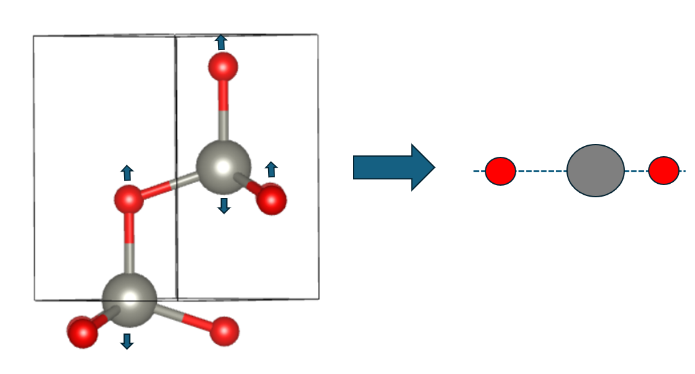

# NEB Calculation

Esse diretório contém cálculos sobre a barreira de inversão do ZnO.

Atualmente, temos estrutura com polarização na direção $ - \hat{z}$ como mostra a figura abaixo:


A ideia é deixar o Oxigênio e o Zinco coplanares, pois a curva de energia é simétrica, i.e:

$$
E(P < 0) = E(P > 0)
$$

Para deixar coplanares, vou pegar o $z_{mean}$ entre a ligação Zn-O e criar uma estrutura com
essa configuração. Essa será a estrutura final do meu neb.in



---

## Coordenadas PBE + U

- $P < 0$

```Fortran
ATOMIC_POSITIONS crystal
Zn 0.3333333333 0.6666666667 -0.0007998299  
Zn 0.6666666667 0.3333333333 0.4992001701  
O 0.3333333333 0.6666666667 0.3807998299  
O 0.6666666667 0.3333333333 0.8807998299
```
