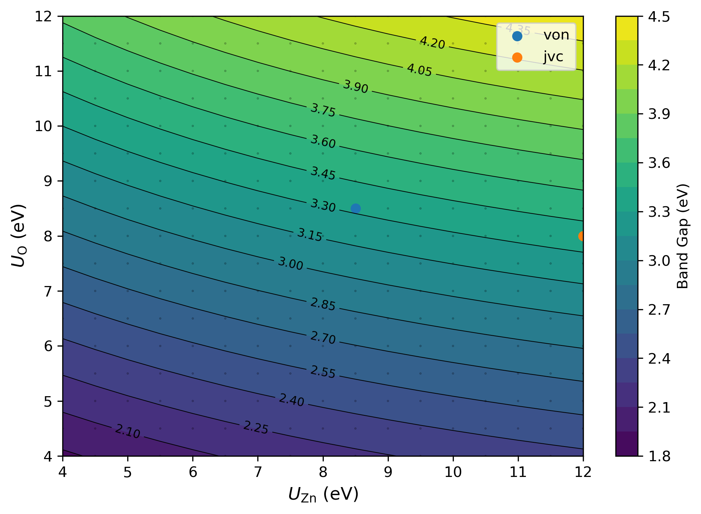
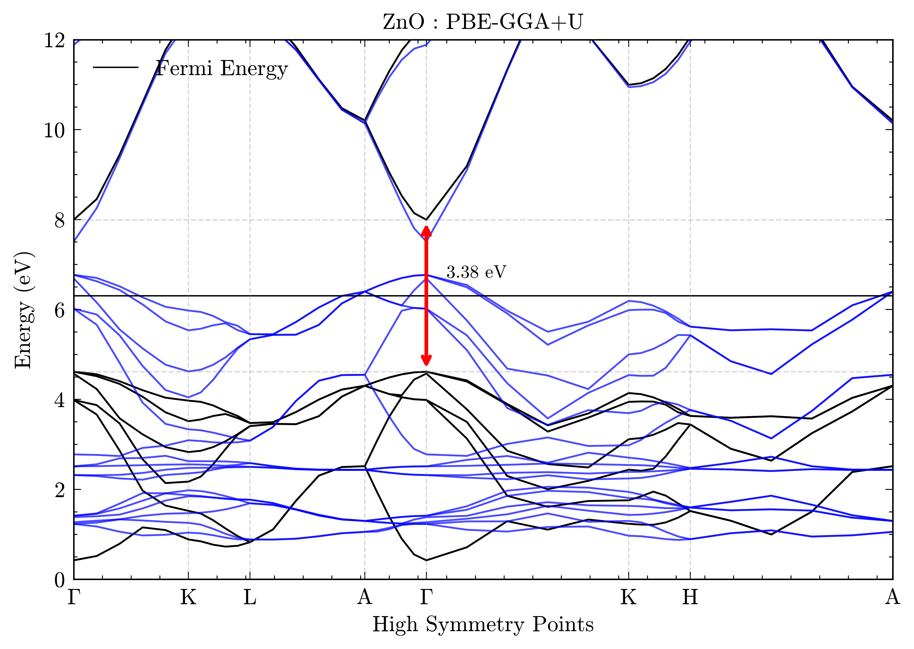

<h1> DFT+U  ZnO</h1>

This directory contains a study on the DFT+U on Zinc Oxide and its impact o band gap energy. We performed self-consistent calculations ranging the Hubbard parameter from 4-12eV in steps of 0.5eV on the strucuture previous optimized. We identified the better $U_{\text{Zn}}$ and $U_{\text{O}}$ values compared to room temperature experimental value, and then a variable cell calculation to see if lattice parameters would exhibit a significant change. 

The optimal U values found where 12.0 and 8.0 eV for Zinc and Oxygen, respectively.



<h2> Variable Cell Calculation </h2>

```bash
(base) jvc@perseu:~/QEspresso7.2/ZnO_database/Hubbard_Tests$ grep -A15 "Begin final " ZnO_relax_hubbard.out 
Begin final coordinates
     new unit-cell volume =    326.24072 a.u.^3 (    48.34389 Ang^3 )
     density =      5.59049 g/cm^3

CELL_PARAMETERS (alat=  6.17882141)
   1.000161237   0.000000000   0.000000000
  -0.500080619   0.866165039   0.000000000
   0.000000000   0.000000000   1.596432523

ATOMIC_POSITIONS (crystal)
Zn            0.6666666667        0.3333333333        0.4989660065
Zn            0.3333333333        0.6666666667       -0.0010339935
O             0.6666666667        0.3333333333        0.8813439935
O             0.3333333333        0.6666666667        0.3813439935
End final coordinates
```

As can be seen above, there is no major difference at the structure and thus the GGA approach gives a good result for what is intended to ænet's package (XSF structures with total energy values).

 <h2> Band Structure </h2>
Then we proceeded to calculate the band structure of Zinc Oxide, comparing to the previous one.



Visually, the band structure of DFT+U has a similar shape compared to GGA-PBE but has a dislocated valence band.