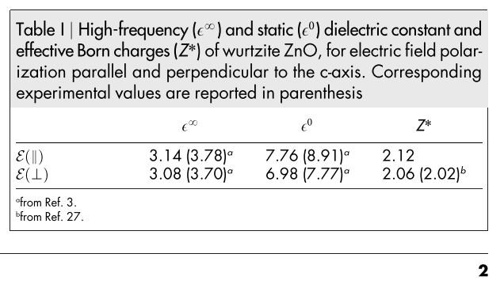

# Fônons em materiais polares

Em materiais __polares__ no limite em que $\bm{q} \rightarrow 0$ (perto do ponto $\Gamma$), um campo elétrico macroscópico surge
como consequência das interações de longo alcance de Coulomb. Essas interações de longo alcance _são incompatíveis com condições de contorno periódicas_.

Como essa contribuição de longo alcance não é suave em $\bm{q} = 0$, ela não aparece naturalmente na parte _“analítica”_ da matriz dinâmica obtida só com constantes de força de curto alcance. Por isso, diz-se que um termo “não-analítico” precisa ser adicionado explicitamente às constantes de força em q=0.


Para resolver o problema acima, um termo não analítico __é adicionado__ às constantes de força em $\bm{q} = 0$:

$$
\tilde C^{\alpha\beta}_{st,\mathrm{NA}}(\mathbf q)
= \frac{4\pi}{\Omega}\;
\frac{\big(\mathbf q\!\cdot\!\mathbf Z_s^{*}\big)_{\alpha}\;
      \big(\mathbf q\!\cdot\!\mathbf Z_t^{*}\big)_{\beta}}
     {\mathbf q\!\cdot\!\boldsymbol{\varepsilon}^{\infty}\!\cdot\!\mathbf q}
$$

_Note que o denominador é_ $\propto |q|^2$.

__Símbolos__:
- $\tilde C^{\alpha\beta}_{st,\mathrm{NA}}(\mathbf q)$ 

Parte não-analítica do tensor de constantes de força dinâmico (ou matriz dinâmica) entre os átomos $s$ e $t$, nas direções $\alpha$ e $\beta$. Representa o acoplamento de longo alcance entre íons devido às interações dipolo–dipolo.

- $\big(\mathbf  Z_s^{*}\big)$

__Cargas efetivas de Born__ descrevem como a polarização macroscópica muda quando o átomo 
$s$ se desloca. Fisicamente, quantificam o acoplamento entre deslocamentos atômicos e o campo elétrico macroscópico.

- $\varepsilon^{\infty}$  
__Tensor dielétrico eletrônico__ representa a resposta do sistema eletrônico a um campo elétrico oscilante, sem permitir relaxação iônica, i.e, os núcleos (íons) são mantidos fixos nas suas posições de equilíbrio. _Obs_: $\varepsilon^{0}$ seria a resposta estática total, incluindo a relaxação iônica. 

<div align="center">



</div>


# Quantum ESPRESSO
---
`ph.out` 
```
     End of electric fields calculation

          Dielectric constant in cartesian axis 

          (       6.826323914      -0.000000000       0.000000000 )
          (      -0.000000000       6.826323914       0.000000000 )
          (       0.000000000       0.000000000       6.075081354 )

          Effective charges (d Force / dE) in cartesian axis without acoustic sum rule applied (asr)

           atom    1  Zn    Mean Z*:        2.14681
      Ex  (        2.14023        0.00000        0.00000 )
      Ey  (        0.00000        2.14023       -0.00000 )
      Ez  (        0.00000       -0.00000        2.15997 )
           atom    2  Zn    Mean Z*:        2.14681
      Ex  (        2.14023        0.00000        0.00000 )
      Ey  (        0.00000        2.14023        0.00000 )
      Ez  (       -0.00000        0.00000        2.15997 )
           atom    3  O     Mean Z*:       -2.22243
      Ex  (       -2.22516        0.00000        0.00000 )
      Ey  (        0.00000       -2.22516        0.00000 )
      Ez  (       -0.00000       -0.00000       -2.21697 )
           atom    4  O     Mean Z*:       -2.22243
      Ex  (       -2.22516        0.00000       -0.00000 )
      Ey  (        0.00000       -2.22516        0.00000 )
      Ez  (       -0.00000       -0.00000       -2.21697 )

          Effective charges Sum: Mean:       -0.15124
             -0.16985        0.00000       -0.00000
              0.00000       -0.16985       -0.00000
              0.00000        0.00000       -0.11401

          Effective charges (d Force / dE) in cartesian axis with asr applied: 
           atom    1  Zn    Mean Z*:        2.18462
      E*x (        2.18269        0.00000        0.00000 )
      E*y (        0.00000        2.18269       -0.00000 )
      E*z (        0.00000        0.00000        2.18847 )
           atom    2  Zn    Mean Z*:        2.18462
      E*x (        2.18269        0.00000       -0.00000 )
      E*y (        0.00000        2.18269       -0.00000 )
      E*z (        0.00000        0.00000        2.18847 )
           atom    3  O     Mean Z*:       -2.18462
      E*x (       -2.18269       -0.00000       -0.00000 )
      E*y (       -0.00000       -2.18269        0.00000 )
      E*z (       -0.00000        0.00000       -2.18847 )
           atom    4  O     Mean Z*:       -2.18462
      E*x (       -2.18269       -0.00000       -0.00000 )
      E*y (       -0.00000       -2.18269        0.00000 )
      E*z (        0.00000       -0.00000       -2.18847 )
```

---
<div align="center">


| Quantity                                | Component | QE result | Literature (theory) | Deviation |
| --------------------------------------- | --------- | --------- | ------------------- | --------- |
| ε∞ (high-frequency dielectric constant) | ⊥ (x,y)   | 6.83      | 3.08                | ≈ +120 %  |
| ε∞ (high-frequency dielectric constant) | ∥ (z)     | 6.08      | 3.14                | ≈ +94 %   |
| Z* (Born charge, Zn)                    | ⊥         | 2.18      | 2.06                | ≈ +6 %    |
| Z* (Born charge, Zn)                    | ∥         | 2.19      | 2.12                | ≈ +3 %    |

</div>


**Interpretação**

* Os valores das cargas efetivas de Born (Z*) estão excelentes: dentro de ≈ 3–6 % da referência, indicando que o acoplamento entre deslocamentos atômicos e campo elétrico macroscópico foi bem descrito.
* As constantes dielétricas de alta frequência (ε∞) estão aproximadamente um fator ≈ 2 acima dos valores de referência. Isso pode decorrer de:
     * ausência de efeitos de campo local na descrição eletrônica,
     * uso de pseudopotenciais ultrasuaves, que tendem a superestimar a polarizabilidade,
     * presença de broadening metálico ou critérios de convergência insuficientes.
* Apesar da superestimação em magnitude, a anisotropia (diferença plano ⟂ vs. eixo ∥) está preservada, indicando consistência numérica e respeito às simetrias.
* Conclusão: resultados fisicamente razoáveis — cargas de Born confiáveis; ε∞ requer refinamento (malha de k mais densa, aumento de ecutrho, redução do smearing e verificação da correção não analítica).

**Avaliação da qualidade**

* Os valores de **Z*** confirmam que a resposta de polarização de longo alcance foi capturada corretamente → pseudopotenciais e convergência adequados.
* Os valores de **ε∞** __estão sistematicamente superestimados__, mas mantêm isotropia entre plano (⟂) e eixo (∥) → simetria preservada e consistência numérica.
* Conclusão: resultados fisicamente razoáveis — cargas de Born confiáveis; as constantes dielétricas exigem refinamento (malha de k mais densa, aumento de ecutrho, redução do smearing e verificação da correção não analítica).

