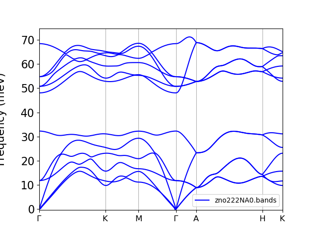
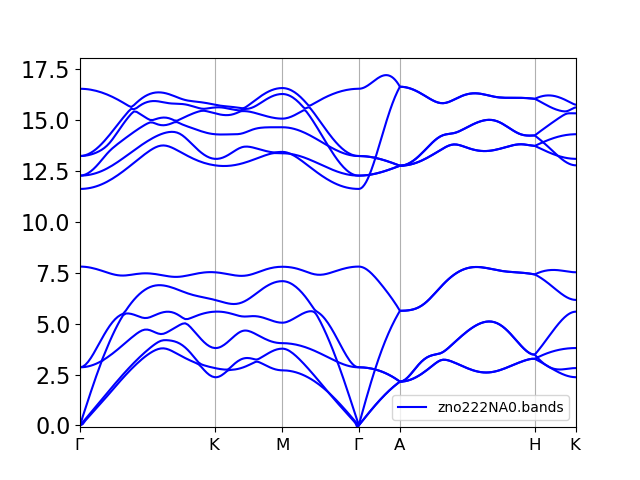
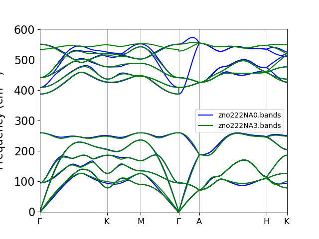
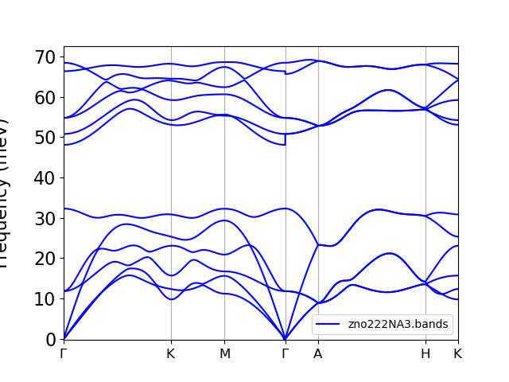

# Dispersão de Fônons - ALAMODE + QE

Aqui foi feita a dispersão de fônons utilizando o ALAMODE junto do Quantum ESPRESSO. Para o ZnO, faz-se a correção não analítica. 

1. Montei o `01-alm-suggest.in` com auxílio do arquivo `create_supercell.py`, tomando como estrutura de referência a relaxada, criando a supercélula com o método `Atoms.repeat((2,2,2))` e fazendo $Zn \rightarrow 1$ e $O \rightarrow 2$ nas posições atômicas nas coordenadas cristalinas. Utilizei os vetores de rede com o $a$ em Bohr.

2. Fiz os arquivos `disp*.pw.in` e rodei com o script `run_disp.sh`.

3. Montei o **DFSET_harmonic** com:
    - `$ python ~/alamode/tools/extract.py --QE=scf-222.pwi --offset scf-222.pwo disp*.pw.out > DFSET_harmonic`

4. Obtive `zno222.xml` e `zno222.fcs` através de:
    - `$ alm 02-alm-optimize.in > 02-alm-optimize.out`

5. Depois fiz a dispersão de fônons sem a correção não-analítica e com a correção não-analítica:
     -  `$ anphon 03-anphon-zno_phband_NA0.in > 03-anphon-zno_phband_NA0.out`
    -   `$ anphon 03-anphon-zno_phband_NA3.in > 03-anphon-zno_phband_NA3.out`
        - Esse aqui exige o arquivo `zno.born` com informações a respeito das constantes dielétricas e cargas efetivas de Born.

Com a observação de alterar o **PREFIX** no **03-anphon-zno_phband_NA3.in**.

Como a dispersão de fônons já havia feita via DFPT, reutilizei os resultados de lá ( [ZnO.ph.out](/home/jvc/ZnO_database/DFT_LDA/02_phonon_DFPT/ZnO.ph.out) ) para montar o arquivo necessário para o **BORNINFO** (`zno.born`).

Aqui o trecho específico do [ZnO.ph.out](/home/jvc/ZnO_database/DFT_LDA/02_phonon_DFPT/ZnO.ph.out):

    End of electric fields calculation

          Dielectric constant in cartesian axis 

          (       6.706735786       0.000000000       0.000000000 )
          (       0.000000000       6.706735784       0.000000000 )
          (       0.000000000       0.000000000       6.205228735 )

          Effective charges (d Force / dE) in cartesian axis without acoustic sum rule applied (asr)

           atom    1  Zn    Mean Z*:        2.15826
      Ex  (        2.14997       -0.00000        0.00000 )
      Ey  (       -0.00000        2.14997        0.00000 )
      Ez  (       -0.00000       -0.00000        2.17485 )
           atom    2  Zn    Mean Z*:        2.15826
      Ex  (        2.14997       -0.00000       -0.00000 )
      Ey  (       -0.00000        2.14997       -0.00000 )
      Ez  (        0.00000        0.00000        2.17485 )
           atom    3  O     Mean Z*:       -2.19139
      Ex  (       -2.18927       -0.00000       -0.00000 )
      Ey  (       -0.00000       -2.18927       -0.00000 )
      Ez  (        0.00000        0.00000       -2.19563 )
           atom    4  O     Mean Z*:       -2.19139
      Ex  (       -2.18927       -0.00000       -0.00000 )
      Ey  (       -0.00000       -2.18927       -0.00000 )
      Ez  (        0.00000       -0.00000       -2.19563 )

          Effective charges Sum: Mean:       -0.06626
             -0.07861       -0.00000       -0.00000
             -0.00000       -0.07861       -0.00000
             -0.00000        0.00000       -0.04157

          Effective charges (d Force / dE) in cartesian axis with asr applied: 
           atom    1  Zn    Mean Z*:        2.17483
      E*x (        2.16962       -0.00000        0.00000 )
      E*y (       -0.00000        2.16962        0.00000 )
      E*z (       -0.00000       -0.00000        2.18524 )
           atom    2  Zn    Mean Z*:        2.17483
      E*x (        2.16962       -0.00000       -0.00000 )
      E*y (       -0.00000        2.16962       -0.00000 )
      E*z (        0.00000        0.00000        2.18524 )
           atom    3  O     Mean Z*:       -2.17483
      E*x (       -2.16962        0.00000       -0.00000 )
      E*y (        0.00000       -2.16962       -0.00000 )
      E*z (        0.00000        0.00000       -2.18524 )
           atom    4  O     Mean Z*:       -2.17483
      E*x (       -2.16962        0.00000       -0.00000 )
      E*y (        0.00000       -2.16962       -0.00000 )
      E*z (        0.00000       -0.00000       -2.18524 )

## Resultados 
### Sem correção não-analítica

### Comparando correção não-analítica vs Sem correção não-analítica__ (cm^-1):

### Correção não-analítica

---
