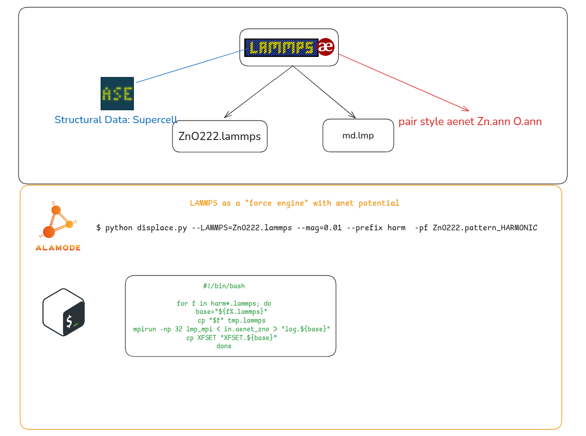

1. Estrutura da supercélula via ASE:
- `ZnO222.pw.in` $ \xrightarrow[\text{laamps-data}]{ASE \ I/O}$ `ZnO222.lammps`

2. Executar o suggest.in (`alm`) com mesma estrutura de supercélula: 
    - Output: `ZnO222.pattern_HARMONIC`
3. `displace.py`: 

 ```bash
 python $HOME/alamode/tools/displace.py --LAMMPS=ZnO222.lammps --mag=0.01 --prefix lmp_harm -pf ZnO222.pattern_HARMONIC
 ```
Verifica a criação dos arquivos.
```bash
(base) jvc@perseu:~/MLFF/phonons_aenet$ ls lmp_harm*
lmp_harm01.lammps  lmp_harm03.lammps  lmp_harm05.lammps  lmp_harm07.lammps  lmp_harm09.lammps
lmp_harm02.lammps  lmp_harm04.lammps  lmp_harm06.lammps  lmp_harm08.lammps  lmp_harm10.lammps
 ```