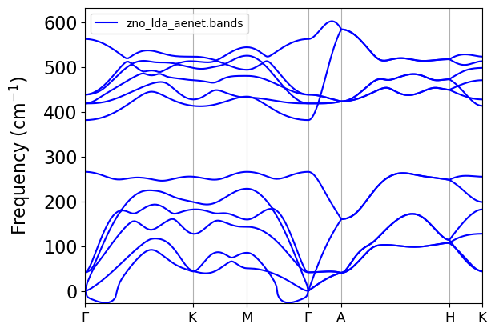

# Comparing model001 vs Finite Differences

| aenet-PyTorch | QE Finite Diff | 
|:-------------:|:--------------:|
|  |  |

`model001` had the following initial setup:
- Structures which the sigma value was superior than the max($F_{\sigma}$) with $\sigma = 0.06$ were removed from the dataset
- generate.x used 15% of the forces of the dataset
- train.in used:
    - hyperbolic tangent activation
    - two hidden layers with 10 nodes each
    - $\alpha = 0.2$ in the evaluation of $\mathcal{L} = \mathcal{L}_E(1 - \alpha) + \alpha \mathcal{L}_F$

---    