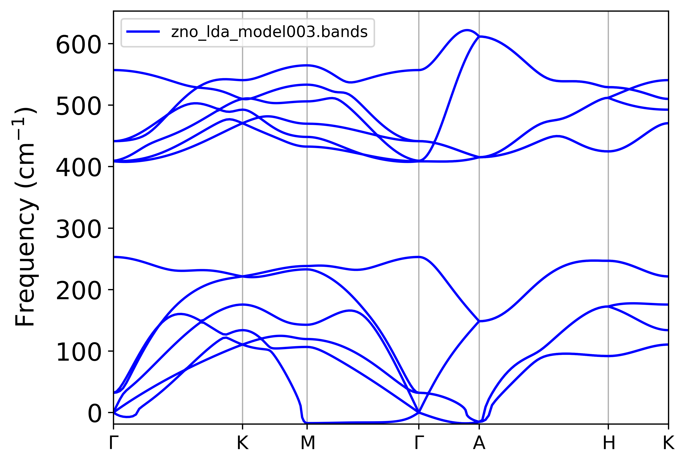

Colocar aqui o modelo com:

- filtro nas energias e forças
- modos normais
- estruturas 1x1x8

## Setup e Métricas

- Inclusão de 15% das forças no generate.x
- Peso na Loss Function ($\alpha$ = 0.2)
- 2000 épocas

|      |   Energy (eV/atom) |   Fx (eV/Å) |   Fy (eV/Å) |   Fz (eV/Å) |   F (eV/Å) |
|:-----|-------------------:|------------:|------------:|------------:|-------------:|
| RMSE |         0.00822999 |    0.380688 |    0.427578 |     0.40901 |     0.630909 |

Indicativo que talvez a dispersão de fônons venha melhor porque o erro das
componentes agora tá na mesma ordem de grandeza.

## Dispersão

Não foi o suficiente pra tirar os fônons negativos e ainda deu uma shiftada pra baixo nas bandas acústicas e uma flat de $m$ pra $\Gamma$ ????
