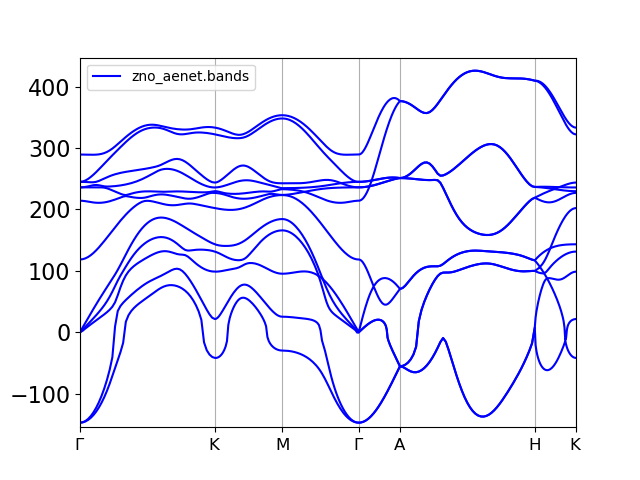
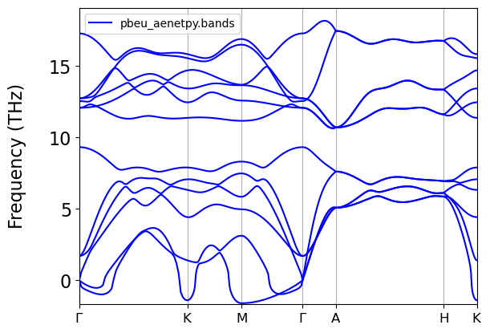

# README

O treinamento aqui foi feito com o **aenet-PyTorch** para um dataset de PBE+U, sem as estruturas com $\sigma = 0.12$ eliminando **TODAS** elas.

Qualitativamente, foram melhores que o primeiras bandas (*horríveis*) produzidas com o ænet com o LDA 

**aenet-LDA com todos os sigmas**  
(OBS: *só faz sentido comparar PBE+U e LDA pois diferem em shifts rígidos de frequências*):

que tiveram bandas muito distorcidas, **fônons negativos** etc; o que foi um indicativo que eu ***deveria excluir as estruturas com $\sigma=0.12$ dos treinamentos***.

 Assim o fiz e testei no dataset com PBE+U $\sigma=\{0.00, 0.04, 0.06\}$.

Melhora significativa comparada ao anterior.

Ainda, usei outra metodologia na escolha de estruturas para incluir uma parcela
das estruturas com $\sigma = 0.12$, mas *somente aquelas cuja a maior componente de força em um átomos fosse menor ou igual, a maior componente de força do grupo de estruturas com $\sigma = 0.06$*.

O resultado dessa metodologia (mas com LDA) foi: 

Que foi MUITO MELHOR. Detalhes mais específicos desse foram:

- generate.x com inclusão de 15% das forças do dataset
- train.x com $\alpha = 0.2$ por 4000 épocas; tanh; 2 camadas, 10 nós

Mais detalhes em: [comparing.md](../../../03_mlff_aenetpytorch/LDA/model001/comparing.md)

---