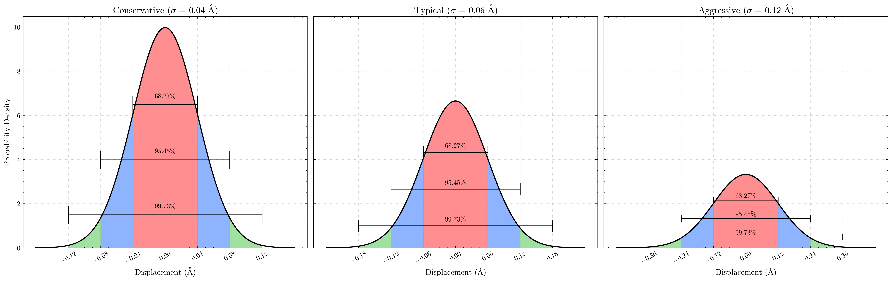

# Organization of Directory

The following directory contains Inputs and Outputs of anisotropically strained __pertubed crystalline structures__. 


<div align="center">

| Supercells 
| :-----------------------------------:|
| random_1x1x2.in • random_1x1x3.in • random_1x2x1.in |
| random_1x2x2.in • random_1x3x1.in • random_2x1x1.in |
| random_3x1x1.in |


</div>

Inputs Files generated using `get_supercell_dir.py` after fix of Aug. 22.

The Random Displacements were generated using __ASE__ Python Library, especifically, the `Atoms.rattle()` method. The name convention adopted here is:

```python
input_name = f'ZnO-{primitive_a:.2f}-{primitive_covera:.2f}-{nx}{ny}{nz}-{noise_std_dev}.in' 
```

Here, `noise_std_dev` refers to $\sigma$ value of the Gaussian Distribution. In the study, three levels of noise were adopted:
<div align="center">

| Level      | σ (Å) |
|------------|-------|
| Conservative| 0.04  |
| Typical    | 0.06  |
| Aggressive | 0.12  |

</div>




 In that sense each choice of $(a,c/a)$ has 3 different configurations.

```shell
ZnO-2.94-1.45-112-0.04-1.in # Conservative
ZnO-2.94-1.45-112-0.06-2.in # Typical
ZnO-2.94-1.45-112-0.12-3.in # Agressive
```

At the end of each file, for reproducibility and quantitative and qualitative evaluation of the displacements produced, there is a table with the displacements produced and the random seed used in the calculation.

```shell
! ========================================================
! Gaussian random displacements added (std=0.040 Å)
! Random seed = 173005330
! Format: atom_index   dx   dy   dz   (Å)
!   1    0.014317    0.019146   -0.051441
!   2    0.030022    0.026238    0.018261
!   3   -0.001962   -0.036570   -0.077330
!   4   -0.052880   -0.022336   -0.058229
!   5   -0.046272    0.032990    0.004278
!   6   -0.067675    0.061584   -0.030934
!   7    0.023064   -0.001957    0.033612
!   8    0.025963   -0.066302    0.031341
!   9    0.049198   -0.004474   -0.000276
!  10   -0.024803   -0.061339    0.055755
!  11    0.048656   -0.035755   -0.020082
!  12    0.031991    0.017984    0.061288
! ========================================================
```

__Note__: `random_1x1x2.in` was the first supercell of calculations and does not contain that info. All the other six adress thefeature mentioned above.